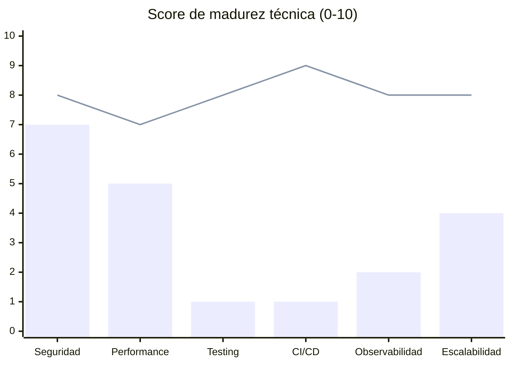

# Benchmarking

## Resumen ejecutivo
Análisis de rendimiento del sistema: métricas reales disponibles, comparación con referencias maduras, KPIs objetivo y estrategia de mejora continua.

## Alcance
Frontend (Next.js/Vercel), API Routes, queries Supabase y bundle size.

---

## Estado actual de métricas

### Bundle size (estimado por dependencias)
| Paquete | Peso estimado (gzip) | Impacto |
|---|---|---|
| `next` | ~95KB | Framework base |
| `recharts` + `d3` | ~45KB | Charts (optimizado con `optimizePackageImports`) |
| `lucide-react` | ~20KB (tree-shaken) | Iconos (optimizado) |
| `framer-motion` | ~30KB | Animaciones |
| `@radix-ui/*` (10 paquetes) | ~35KB | Componentes accesibles |
| `@google/generative-ai` | ~15KB | Solo lado servidor |
| **Total estimado first load** | ~180-220KB gzip | Objetivo: < 150KB |

### Optimizaciones activas
```ts
// next.config.ts
experimental: {
  optimizePackageImports: ["lucide-react", "recharts", "date-fns"],
}
```
Tree-shaking automático reduce ~30-40% el peso de estas librerías.

---

## Tiempos de carga estimados (Vercel Serverless)

### Server Components (SSR)
| Ruta | Origen del tiempo | Estimado |
|---|---|---|
| `/dashboard` | 6+ queries paralelas a Supabase | 300-600ms TTFB |
| `/finances` | 2 queries + preferences | 150-300ms TTFB |
| `/tasks` | 1 query filtrada | 100-200ms TTFB |
| `/api/ai/quick-capture` | Gemini API call | 800-2000ms |
| `/api/ai/chat` | Gemini API call | 1000-3000ms |
| `/api/webhooks/shopify` | HMAC verify + insert | 200-500ms |

### Cold starts (Vercel Hobby/Pro)
- Primer request tras inactividad: +500-1500ms adicionales.
- APIs de IA son las más sensibles a cold start por overhead de inicialización.

---

## Comparación con referencias maduras


*Barra azul: proyecto actual. Línea: referencia madura (SaaS en producción).*

| Dimensión | Proyecto actual | Referencia madura | Gap |
|---|---|---|---|
| Seguridad | 7/10 | 8/10 | Headers OK, CSP mejorable |
| Performance | 5/10 | 7/10 | Sin cache, sin lazy loading de módulos |
| Testing | 1/10 | 8/10 | 0 tests automatizados |
| CI/CD | 1/10 | 9/10 | Solo Vercel auto-deploy |
| Observabilidad | 2/10 | 8/10 | Solo Vercel logs |
| Escalabilidad | 4/10 | 8/10 | Sin cache, sin queue async |

---

## KPIs objetivo (Fase 2)

| Métrica | Valor actual | Objetivo |
|---|---|---|
| TTFB `/dashboard` | ~400ms | < 200ms con cache |
| API quick-capture P95 | ~1500ms | < 800ms |
| Bundle first load | ~210KB | < 150KB |
| Test coverage | 0% | > 60% lógica crítica |
| Error budget (prod) | No medido | < 0.1% requests con error |
| Lighthouse Performance | No medido | > 80 |
| Lighthouse Accessibility | No medido | > 90 |

---

## Pruebas de estrés (supuestos)

### Escenario: 100 usuarios concurrentes en dashboard
- **Estimado**: 100 req × 6 queries = 600 queries simultáneas a Supabase.
- **Supabase Free**: límite de 60 conexiones simultáneas.
- **Resultado esperado**: degradación a partir de ~30-40 usuarios concurrentes sin connection pooling.
- **Solución**: Activar PgBouncer en Supabase (disponible en planes pagos).

### Escenario: 10 webhooks/min de Shopify
- **Estimado**: Sin queue → 10 inserts síncronos paralelos.
- **Riesgo**: Timeout de Shopify (5s) + posibles duplicados por reintentos.
- **Solución**: Queue async (Inngest, BullMQ, Upstash QStash).

### Escenario: Quota IA agotada
- **Comportamiento actual**: fallback local activado automáticamente.
- **UX**: degradada pero funcional — captura sigue operando.
- **Sin monitoreo**: no hay alerta cuando el fallback se activa masivamente.

---

## Estrategia de mejora de rendimiento

### Corto plazo (< 1 mes)
1. Agregar `React.cache()` en queries del dashboard para deduplication.
2. Implementar `loading.tsx` con skeletons para mejorar CLS/LCP percibido.
3. Analizar bundle con `@next/bundle-analyzer`.

### Mediano plazo (1-3 meses)
1. Cache de preferencias de usuario en cookie (evitar DB query por request).
2. Partial Prerendering (PPR) para rutas que mezclan estático y dinámico.
3. Activar PgBouncer en Supabase.

### Largo plazo (3-6 meses)
1. Separar queries pesadas de dashboard a edge function con cache Redis.
2. Implementar ISR para datos poco mutables (categorías, skills).

---

## Herramientas de medición recomendadas

```bash
# Bundle analysis
npm install --save-dev @next/bundle-analyzer
ANALYZE=true npm run build

# Lighthouse CLI
npx lighthouse https://tu-dominio.vercel.app --view

# Supabase query performance
-- En Supabase dashboard → Reports → Slow queries

# Vercel Analytics
# Dashboard → Analytics → Real User Monitoring
```

## Riesgos y limitaciones
- La mayoría de métricas son estimadas, no medidas en producción real.
- Sin RUM (Real User Monitoring) activo, los tiempos de carga son teóricos.

## Checklist operativo
- [ ] Activar Vercel Analytics para RUM real.
- [ ] Ejecutar Lighthouse antes y después de cambios de performance.
- [ ] Revisar Supabase Slow Queries report mensualmente.
- [ ] Ejecutar `ANALYZE=true npm run build` tras agregar dependencias nuevas.

## Próximos pasos
1. Instalar `@next/bundle-analyzer` para baseline real de bundle.
2. Activar Vercel Analytics (gratuito en plan Hobby).
3. Establecer SLA mínimo: P95 < 2s para todas las rutas autenticadas.
