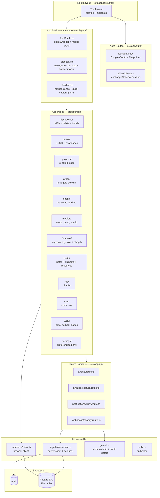

# Component Diagram

## Resumen ejecutivo
Jerarquía completa de componentes del sistema: layout shell, páginas de dominio, APIs y capa de datos. Basado en la estructura real de `src/`.

## Alcance
Cubre `src/app/`, `src/components/`, `src/lib/` y sus interacciones.

## Diagrama principal

## Detalle por módulo

### Header + Quick Capture
- Archivo: `src/components/layout/Header.tsx`
- Funciones: notificaciones in-app, modal de quick capture, voice-to-text (Web Speech API).
- Portal React para evitar clipping del modal por sticky header.
- Llama a `POST /api/ai/quick-capture`.

### Dashboard
- Archivo: `src/app/(app)/dashboard/page.tsx`
- Server Component que agrega datos de 6+ tablas.
- Respeta `profiles.preferences` para cards visibles, orden, trend days y formato financiero.
- Subcomponentes: `TrendChart.tsx`, `FinanceTrendChart.tsx`.

### Settings
- Archivo: `src/app/(app)/settings/SettingsClient.tsx`
- Persiste en `profiles.preferences` (JSONB):
  - Horario de recordatorios, días activos.
  - Canales de notificación por tipo (push/email/in-app).
  - Metas (agua, sueño, pasos, gasto diario).
  - Quick capture: prioridad default, categorías favoritas, auto-tags.
  - Formato financiero: moneda, locale, agrupamiento.
  - Dashboard: cards visibles, orden, trend range.

### Quick Capture (API)
- Archivo: `src/app/api/ai/quick-capture/route.ts`
- Valida sesión → carga preferencias → clasifica con Gemini o fallback local → inserta en tabla target.
- Tablas destino: `tasks`, `habits`, `daily_metrics`, `finances`, `brain_notes`.

## Flujos clave
1. Usuario escribe en quick capture → Header → API → Supabase.
2. Settings guarda → `profiles.preferences` → Dashboard y Finances lo leen al renderizar.
3. Shopify webhook → API → `finances` + `webhook_logs`.

## Riesgos y limitaciones
- Lógica de dominio acoplada a route handlers sin capa de servicios intermedia.
- Server Components no pueden compartir estado con Client Components directamente.

## Checklist operativo
- [ ] Verificar que imports cruzados entre dominios no rompan build.
- [ ] Confirmar que portal del modal no cause hydration mismatch.
- [ ] Revisar que TrendChart y FinanceTrendChart reciban data correcta.

## Próximos pasos
1. Extraer `CaptureService`, `FinanceService`, `DashboardService`.
2. Añadir boundaries de error (`error.tsx`) por sección.
3. Crear librería de componentes compartidos (`src/components/ui/`).
