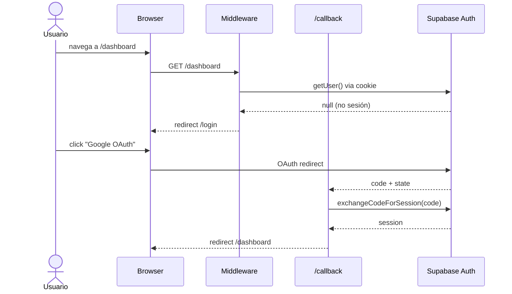
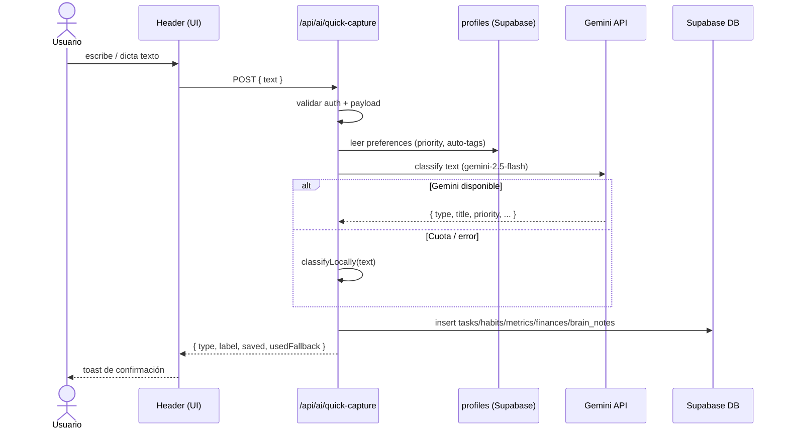
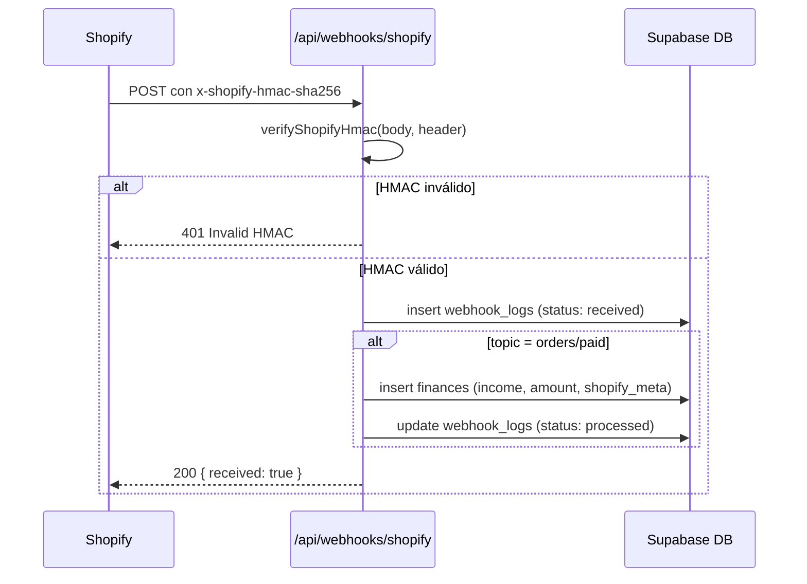
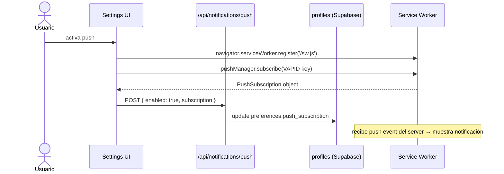

# Data Flow

## Resumen ejecutivo
Documenta todos los flujos de datos críticos del sistema: autenticación, captura inteligente, chat IA, webhook Shopify y push notifications. Cada flujo incluye actores, pasos y puntos de fallo.

## Alcance
Cubre flujos end-to-end desde el navegador hasta Supabase y proveedores externos.

## Archivos de referencia
- `src/middleware.ts`
- `src/app/(auth)/callback/route.ts`
- `src/app/api/ai/quick-capture/route.ts`
- `src/app/api/ai/chat/route.ts`
- `src/app/api/webhooks/shopify/route.ts`
- `src/app/api/notifications/push/route.ts`

---

## Diagrama general de flujo

```mermaid
flowchart TD
    Browser([Navegador / PWA])
    MW[Middleware auth\nsrc/middleware.ts]
    AppRoutes[App Router\nsrc/app/app/]
    API_Chat[POST /api/ai/chat]
    API_QC[POST /api/ai/quick-capture]
    API_Push[POST /api/notifications/push]
    API_WH[POST /api/webhooks/shopify]
    Supabase[(Supabase\nAuth + PostgreSQL)]
    Gemini[Google Gemini API]
    Shopify[Shopify Platform]
    SW[Service Worker\npublic/sw.js]

    Browser -->|request| MW
    MW -->|sesión válida| AppRoutes
    MW -->|sin sesión| Login[/login]
    AppRoutes -->|text input| API_QC
    AppRoutes -->|chat message| API_Chat
    AppRoutes -->|push subscribe| API_Push
    API_QC -->|classify| Gemini
    API_QC -->|fallback local| API_QC
    API_QC -->|insert| Supabase
    API_Chat -->|generate| Gemini
    API_Chat -->|save insight| Supabase
    API_Push -->|update preferences| Supabase
    Shopify -->|signed webhook| API_WH
    API_WH -->|verify HMAC| API_WH
    API_WH -->|insert finance + log| Supabase
    SW -->|push event| Browser
```

---

## Flujo 1: Autenticación



**Punto de fallo crítico**: Si `NEXT_PUBLIC_SUPABASE_URL` o los Redirect URLs en Supabase Auth no están configurados, el callback devuelve error y el usuario queda en `/login`.

---

## Flujo 2: Quick Capture con IA



**Punto de fallo**: Sin `GEMINI_API_KEY`, entra a fallback local. Si Supabase falla en insert, retorna 500.

---

## Flujo 3: Webhook Shopify → Finanzas



**Riesgo activo**: Sin idempotencia por `order_id` — retries de Shopify pueden duplicar transacciones.

---

## Flujo 4: Push Notifications



**Requisito**: `VAPID_PUBLIC_KEY` y `VAPID_PRIVATE_KEY` correctamente configurados.

---

## Configuración y variables de entorno
| Variable | Flujo afectado |
|---|---|
| `NEXT_PUBLIC_SUPABASE_URL` | Todos |
| `NEXT_PUBLIC_SUPABASE_ANON_KEY` | Todos |
| `GEMINI_API_KEY` | Quick Capture, Chat IA |
| `SHOPIFY_WEBHOOK_SECRET` | Webhook Shopify |
| `VAPID_PUBLIC_KEY` / `VAPID_PRIVATE_KEY` | Push Notifications |

## Riesgos y limitaciones
- Sin cola async para eventos (pérdida de webhooks si DB falla).
- Fallback local de IA produce clasificaciones diferentes a Gemini.
- Sin correlación request-id para trazabilidad end-to-end.

## Checklist operativo
- [ ] Confirmar Redirect URLs en Supabase Auth para cada ambiente.
- [ ] Validar SHOPIFY_WEBHOOK_SECRET con firma real.
- [ ] Probar quick-capture con y sin GEMINI_API_KEY.
- [ ] Verificar que Service Worker se registra correctamente en producción.

## Próximos pasos
1. Introducir idempotencia por `shopify_order_id` en webhook.
2. Agregar request-id propagado en todos los flujos.
3. Evaluar queue (BullMQ / Inngest) para procesamiento async de webhooks.
