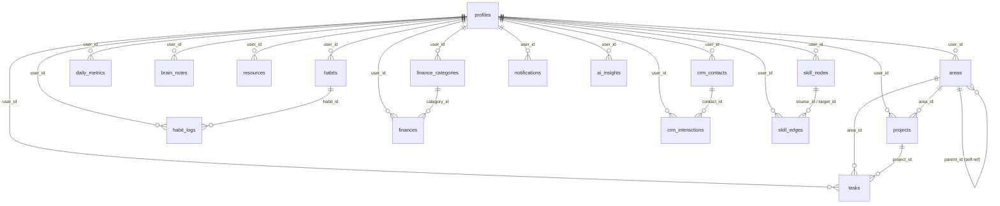

# Data Dictionary

## Resumen ejecutivo
Esquema completo de la base de datos PostgreSQL (Supabase). 16 tablas, relaciones, índices y campos clave. Generado desde `supabase/migrations/001_initial_schema.sql`.

## Alcance
Todas las tablas públicas del proyecto. Incluye constraints, índices y riesgos de integridad.

---

## Diagrama de relaciones



---

## Tablas

### `profiles`
Extiende `auth.users` de Supabase. Un perfil por usuario autenticado.

| Campo | Tipo | Constraint | Descripción |
|---|---|---|---|
| `id` | `uuid` | PK, FK → `auth.users(id)` ON DELETE CASCADE | ID del usuario |
| `full_name` | `text` | nullable | Nombre completo |
| `avatar_url` | `text` | nullable | URL del avatar (Supabase Storage o Google) |
| `timezone` | `text` | NOT NULL, default `'America/Bogota'` | Zona horaria del usuario |
| `preferences` | `jsonb` | NOT NULL, default `'{}'` | Config del usuario (ver esquema de preferences) |
| `created_at` | `timestamptz` | NOT NULL, default `now()` | Creación del perfil |
| `updated_at` | `timestamptz` | NOT NULL, default `now()` | Última actualización |

**Notas**: `preferences` contiene toda la configuración del usuario. Sin esquema fijo — ver documentación en `docs/data/data_dictionary.md#preferences-schema`.

---

### `areas`
Áreas de vida del usuario (Finanzas, Salud, Trabajo, etc.). Soporta jerarquía via `parent_id`.

| Campo | Tipo | Constraint | Descripción |
|---|---|---|---|
| `id` | `uuid` | PK | Identificador único |
| `user_id` | `uuid` | FK → `profiles(id)` ON DELETE CASCADE | Propietario |
| `parent_id` | `uuid` | FK → `areas(id)` ON DELETE SET NULL | Área padre (jerarquía) |
| `name` | `text` | NOT NULL | Nombre del área |
| `icon` | `text` | nullable | Emoji o código de icono |
| `color` | `text` | default `'#3B82F6'` | Color hex del área |
| `order_index` | `int` | NOT NULL, default `0` | Orden de visualización |
| `created_at` | `timestamptz` | NOT NULL | Timestamp de creación |

---

### `projects`
Proyectos asociados a áreas. Tracking de progreso con `completion_pct`.

| Campo | Tipo | Constraint | Descripción |
|---|---|---|---|
| `id` | `uuid` | PK | Identificador único |
| `user_id` | `uuid` | FK → `profiles(id)` | Propietario |
| `area_id` | `uuid` | FK → `areas(id)` nullable | Área asociada |
| `title` | `text` | NOT NULL | Nombre del proyecto |
| `description` | `text` | nullable | Descripción |
| `status` | `text` | CHECK: `active/paused/completed/cancelled` | Estado del proyecto |
| `start_date` | `date` | nullable | Fecha inicio |
| `end_date` | `date` | nullable | Fecha límite |
| `completion_pct` | `int` | CHECK 0-100, default `0` | % de completado |
| `template_config` | `jsonb` | default `'{}'` | Config de plantilla |
| `created_at` / `updated_at` | `timestamptz` | NOT NULL | Timestamps |

---

### `tasks`
Tareas del sistema. Soporta prioridades P1/P2/P3, estados y estimación de tiempo.

| Campo | Tipo | Constraint | Descripción |
|---|---|---|---|
| `id` | `uuid` | PK | Identificador único |
| `user_id` | `uuid` | FK → `profiles(id)` | Propietario |
| `project_id` | `uuid` | FK → `projects(id)` nullable | Proyecto asociado |
| `area_id` | `uuid` | FK → `areas(id)` nullable | Área asociada |
| `title` | `text` | NOT NULL | Título de la tarea |
| `description` | `text` | nullable | Descripción extendida |
| `priority` | `text` | CHECK: `P1/P2/P3`, default `P2` | Prioridad |
| `status` | `text` | CHECK: `todo/in_progress/done/cancelled` | Estado actual |
| `due_date` | `date` | nullable | Fecha límite |
| `completed_at` | `timestamptz` | nullable | Timestamp de completado |
| `estimated_minutes` | `int` | nullable | Tiempo estimado |
| `actual_minutes` | `int` | nullable | Tiempo real invertido |
| `tags` | `jsonb` | default `'[]'` | Lista de etiquetas |

**Índices**: `(user_id, status)`, `(due_date) WHERE due_date IS NOT NULL`, `(user_id, priority)`

---

### `habits`
Definición de hábitos. Los registros de completado están en `habit_logs`.

| Campo | Tipo | Constraint | Descripción |
|---|---|---|---|
| `id` | `uuid` | PK | Identificador único |
| `user_id` | `uuid` | FK → `profiles(id)` | Propietario |
| `name` | `text` | NOT NULL | Nombre del hábito |
| `icon` | `text` | nullable | Emoji del hábito |
| `frequency` | `text` | CHECK: `daily/weekly` | Frecuencia |
| `target_streak` | `int` | default `30` | Racha objetivo en días |

### `habit_logs`
Un registro por hábito completado por día.

| Campo | Tipo | Constraint | Descripción |
|---|---|---|---|
| `habit_id` | `uuid` | FK → `habits(id)` ON DELETE CASCADE | Hábito |
| `user_id` | `uuid` | FK → `profiles(id)` | Propietario |
| `log_date` | `date` | NOT NULL | Fecha del registro |
| `completed` | `boolean` | default `true` | ¿Completado? |
| `notes` | `text` | nullable | Notas opcionales |

**Constraint único**: `(habit_id, log_date)` — un registro por hábito por día.

---

### `daily_metrics`
Métricas de salud diarias: mood, peso, calorías, sueño, energía, estrés.

| Campo | Tipo | Constraint | Descripción |
|---|---|---|---|
| `metric_date` | `date` | NOT NULL | Fecha de la métrica |
| `mood_score` | `int` | CHECK 1-10 | Estado de ánimo |
| `weight_kg` | `numeric(5,2)` | nullable | Peso en kg |
| `calories_kcal` | `int` | nullable | Calorías del día |
| `sleep_hours` | `numeric(4,2)` | nullable | Horas de sueño |
| `sleep_quality` | `int` | CHECK 1-10 | Calidad del sueño |
| `energy_level` | `int` | CHECK 1-10 | Nivel de energía |
| `stress_level` | `int` | CHECK 1-10 | Nivel de estrés |
| `journal_entry` | `text` | nullable | Entrada de diario |

**Constraint único**: `(user_id, metric_date)` — una entrada por día por usuario.
**Índice**: `(user_id, metric_date DESC)`

---

### `brain_notes`
Notas, snippets de código y recursos del cerebro digital.

| Campo | Tipo | Constraint | Descripción |
|---|---|---|---|
| `title` | `text` | NOT NULL | Título de la nota |
| `content` | `text` | default `''` | Contenido principal |
| `type` | `text` | CHECK: `snippet/note/resource` | Tipo de nota |
| `language` | `text` | nullable | Lenguaje (para snippets) |
| `tags` | `jsonb` | default `'[]'` | Etiquetas |
| `area_id` | `uuid` | FK → `areas(id)` nullable | Área asociada |

---

### `finances`
Transacciones financieras. Incluye integración con Shopify.

| Campo | Tipo | Constraint | Descripción |
|---|---|---|---|
| `category_id` | `uuid` | FK → `finance_categories(id)` nullable | Categoría |
| `title` | `text` | NOT NULL | Descripción de la transacción |
| `amount` | `numeric(12,2)` | NOT NULL, CHECK >= 0 | Monto |
| `type` | `text` | CHECK: `income/expense` | Tipo |
| `source` | `text` | nullable | Origen (ej: "Shopify", "transferencia") |
| `transaction_date` | `date` | default `current_date` | Fecha de la transacción |
| `is_shopify` | `boolean` | default `false` | Proviene de webhook Shopify |
| `shopify_meta` | `jsonb` | default `'{}'` | Metadata del pedido Shopify |

**Índice**: `(user_id, transaction_date DESC)`

---

### `notifications`
Notificaciones in-app del sistema.

| Campo | Tipo | Descripción |
|---|---|---|
| `title` | `text` | Título visible al usuario |
| `body` | `text` | Cuerpo del mensaje |
| `type` | `text` | Tipo de notificación |
| `is_read` | `boolean` | Estado de lectura |
| `action_data` | `jsonb` | Datos de acción deep-link |

**Índice**: `(user_id, is_read) WHERE is_read = false` — optimiza conteo de no leídas.

---

### `ai_insights`
Insights generados por IA en el chat.

| Campo | Tipo | Descripción |
|---|---|---|
| `insight_type` | `text` | Tipo (ej: `weekly_summary`, `habit_pattern`) |
| `content` | `text` | Texto del insight |
| `data_snapshot` | `jsonb` | Snapshot de datos usados |
| `confidence_score` | `numeric(4,3)` | Score 0.000-1.000 |
| `insight_date` | `date` | Fecha del insight |

---

### `webhook_logs`
Log de webhooks recibidos (Shopify y futuros).

| Campo | Tipo | Descripción |
|---|---|---|
| `source` | `text` | Origen (ej: `shopify`) |
| `payload` | `jsonb` | Payload completo recibido |
| `status` | `text` | `received / processed / error` |
| `received_at` | `timestamptz` | Timestamp de recepción |

---

## Schema de `profiles.preferences` (campos documentados)

```ts
interface UserPreferences {
  // Recordatorios
  reminder_start?: string;          // "08:00"
  reminder_end?: string;            // "22:00"
  reminder_days?: string[];         // ["mon","tue","wed","thu","fri"]

  // Notificaciones
  notify_tasks_push?: boolean;
  notify_tasks_email?: boolean;
  notify_tasks_inapp?: boolean;
  notify_habits_push?: boolean;
  // ... por tipo (habits, finances)

  // Metas diarias
  goal_water_ml?: number;           // 2000
  goal_sleep_hours?: number;        // 8
  goal_steps?: number;              // 10000
  goal_daily_spend_limit?: number;  // 50000

  // Quick Capture
  quick_capture_default_priority?: "P1" | "P2" | "P3";  // "P3"
  quick_capture_favorite_categories?: string[];
  quick_capture_auto_tags?: string[];

  // Finanzas
  finance_currency?: string;        // "COP"
  finance_locale?: string;          // "es-CO"
  finance_use_grouping?: boolean;   // true

  // Dashboard
  dashboard_visible_cards?: string[];
  dashboard_card_order?: string[];
  dashboard_trend_days?: number;    // 7 | 14 | 30

  // Push
  push_subscription?: PushSubscription;
  push_vapid_public_key?: string;
}
```

## Riesgos y limitaciones
- Sin `shopify_order_id UNIQUE` en `finances` — riesgo de duplicados por retries.
- `preferences` sin schema validation en DB — datos corruptos pasan silenciosamente.
- `habit_logs.unique(habit_id, log_date)` no incluye `user_id` — FK cascade protege, pero es un diseño a revisar.

## Checklist operativo
- [ ] Ejecutar migraciones en orden: 001 → 002 → 003 → 004 → 005.
- [ ] Verificar RLS tras cada nueva tabla (`002_rls_policies.sql`).
- [ ] No editar migraciones existentes — crear siempre nueva (`00N_*.sql`).
- [ ] Documentar nuevas columnas JSONB aquí al agregarlas.

## Próximos pasos
1. Agregar `shopify_order_id TEXT UNIQUE` en `finances`.
2. Crear `006_preferences_schema_validation.sql` con CHECK constraint o función de validación.
3. Documentar el schema completo de `shopify_meta` y `template_config`.
