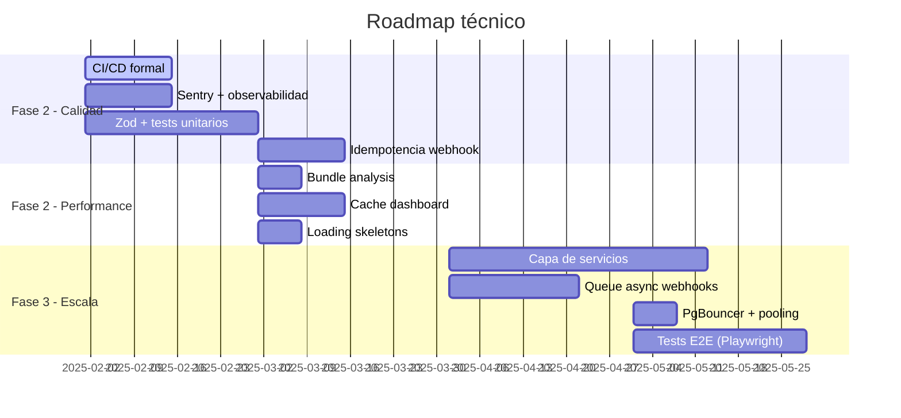

# Future Recommendations

## Resumen ejecutivo
Hoja de ruta técnica para las fases 2 y 3 del proyecto. Cubre tecnologías a adoptar, patrones de escalabilidad, deuda prioritaria a resolver y roadmap por trimestre.

## Alcance
Decisiones técnicas de mediano y largo plazo. No incluye features de producto, solo cambios de infraestructura y arquitectura.

---

## Fase 2 — Estabilización y calidad (0-3 meses)

### Prioridad crítica

#### 1. CI/CD formal (semana 1)
```yaml
# .github/workflows/ci.yml — implementar inmediatamente
- run: npm ci
- run: npm run lint
- run: npx tsc --noEmit
- run: npm run build
```
**ROI**: mayor con menor esfuerzo. Previene builds rotos en master.

#### 2. Observabilidad básica (semana 1-2)
```bash
npm install @sentry/nextjs
npx @sentry/wizard@latest -i nextjs
```
Sin Sentry, los errores en producción son invisibles. El plan gratuito cubre 5000 errores/mes.

#### 3. Zod schema para `preferences` (semana 2-3)
```ts
// src/lib/schemas/preferences.ts
import { z } from "zod";

export const PreferencesSchema = z.object({
  quick_capture_default_priority: z.enum(["P1","P2","P3"]).default("P3"),
  finance_currency: z.string().default("COP"),
  finance_locale: z.string().default("es-CO"),
  dashboard_trend_days: z.number().int().min(7).max(30).default(7),
  // ...
}).partial();

export type UserPreferences = z.infer<typeof PreferencesSchema>;
```

#### 4. Tests unitarios de funciones críticas (semana 2-4)
Priorizar en este orden:
1. `classifyLocally()` — fallback de IA
2. `verifyShopifyHmac()` — seguridad
3. `normalizeTaskPriority()` — clasificación
4. `PreferencesSchema.parse()` — una vez implementado

#### 5. Idempotencia en webhook Shopify (semana 3)
```sql
-- 006_shopify_idempotency.sql
ALTER TABLE public.finances
  ADD COLUMN shopify_order_id TEXT,
  ADD CONSTRAINT unique_shopify_order UNIQUE (user_id, shopify_order_id);
```

---

## Fase 2 — Rendimiento (1-3 meses)

### Cache de datos del dashboard
```ts
// Server Component con React cache para deduplication
import { cache } from "react";
const getUserDashboardData = cache(async (userId: string) => {
  // queries del dashboard
});
```

### Bundle analysis y optimización
```bash
npm install --save-dev @next/bundle-analyzer
# webpack.config en next.config.ts:
const withBundleAnalyzer = require("@next/bundle-analyzer")({ enabled: process.env.ANALYZE === "true" });
ANALYZE=true npm run build
```

**Candidatos para eliminar/reemplazar si el análisis lo justifica**:
- `framer-motion` (~30KB) → si solo se usa para transiciones simples, reemplazar con CSS transitions.
- `d3` (~45KB) → si solo se usa en `skill_nodes`, considerar implementación custom ligera.

### Loading states con Suspense
```tsx
// Reemplazar spinners inline por Suspense + loading.tsx
// src/app/(app)/dashboard/loading.tsx
export default function DashboardSkeleton() {
  return <div className="animate-pulse grid grid-cols-2 gap-4">...</div>;
}
```

---

## Fase 3 — Escalabilidad (3-6 meses)

### Capa de servicios
```
src/services/
├── CaptureService.ts     → clasificación + guardado
├── FinanceService.ts     → transacciones + análisis
├── DashboardService.ts   → agregación de datos
├── NotificationService.ts → push + in-app
└── InsightService.ts     → IA insights
```
Cada servicio tiene interfaz explícita y puede ser testeado independientemente del framework.

### Queue async para webhooks
Opciones por costo/complejidad:
| Opción | Costo | Complejidad | Recomendación |
|---|---|---|---|
| **Inngest** | Gratis hasta 1000/mes | Baja | ✅ Recomendado |
| Upstash QStash | $0.01/mensaje | Baja | Buena alternativa |
| BullMQ + Redis | Variable | Media | Si ya tiene Redis |
| Supabase Edge Functions | Incluido en plan | Media | Si se quiere evitar 3rd party |

```ts
// Inngest integration (recomendado)
import { inngest } from "@/lib/inngest";
export const processShopifyWebhook = inngest.createFunction(
  { id: "shopify-webhook" },
  { event: "shopify/order.paid" },
  async ({ event }) => {
    // procesamiento async con idempotencia automática
  }
);
```

### Connection pooling para Supabase
Activar PgBouncer en Supabase (requiere plan Pro):
- Modo: Transaction pooling.
- Max connections: 25 por defecto.
- Previene errores por límite de 60 conexiones en Serverless.

### Partial Prerendering (PPR)
```ts
// next.config.ts — cuando esté estable en Next.js 15
experimental: {
  ppr: true,
}
```
Mezcla contenido estático (header, sidebar) con dinámico (datos del usuario) en el mismo request.

---

## Tecnologías para Fase 2-3

| Tecnología | Propósito | Prioridad |
|---|---|---|
| `zod` | Schema validation de preferences y payloads | Alta |
| `@sentry/nextjs` | Observabilidad de errores en producción | Alta |
| `vitest` | Tests unitarios | Alta |
| `@playwright/test` | Tests E2E | Media |
| `@next/bundle-analyzer` | Análisis de bundle | Media |
| `inngest` | Queue async para webhooks | Media |
| `prettier` + `husky` | Calidad de código automatizada | Media |
| `@tanstack/react-query` | Cache de queries en cliente (ya instalado, sin usar) | Baja |

---

## Roadmap de escalabilidad



---

## Decisiones a evaluar en Fase 3

1. **¿Separar FE y BE?** → Considerar si el equipo crece o si se necesitan releases independientes.
2. **¿Migrar preferencias a tabla normalizada?** → Si el schema de preferences llega a >20 campos.
3. **¿Agregar modo claro?** → Requiere auditar todos los colores hardcodeados en componentes.
4. **¿Supabase Edge Functions?** → Para lógica de negocio que requiere latencia < 50ms globalmente.

## Riesgos y limitaciones
- Inngest y otros servicios de queue tienen su propio costo de lock-in.
- PPR está en experimental en Next.js 15 — no apto para producción crítica aún.
- La capa de servicios requiere refactor significativo de los route handlers existentes.

## Checklist operativo
- [ ] Revisar este roadmap en cada sprint planning mensual.
- [ ] No avanzar a Fase 3 sin CI y tests básicos activos.
- [ ] Evaluar bundle size real antes de decidir qué optimizar.

## Próximos pasos
1. Implementar CI esta semana (< 4h de trabajo).
2. Instalar Sentry antes del próximo push a producción.
3. Crear `src/lib/schemas/preferences.ts` con zod.
